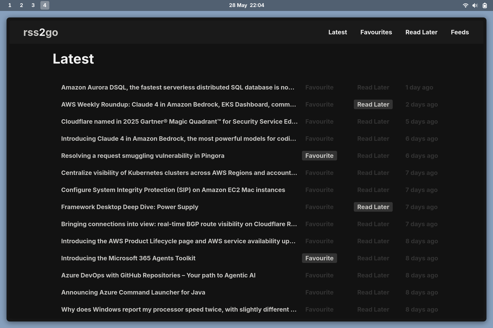

# rss2go



> rss2go is a self-hosted RSS reader built with Go

- [Link to docker hub](https://hub.docker.com/repository/docker/nathanberry97/rss2go/general)

## Getting started

If you want to run the application locally ensure you have `sass` and `go`
installed then run the following command:

```
make run
```

Which will allow you to access the website on `localhost:8080`.

Or if you have `podman` installed you can run the following command:

```
make container
```

## Overview

Folder structure:

```txt
.
├── cmd
│   └── app
├── internal
│   ├── components
│   ├── database
│   ├── routes
│   ├── rss
│   ├── schema
│   ├── scss
│   ├── services
│   ├── utils
│   └── worker
└── web
    ├── scss
    │   ├── abstracts
    │   ├── base
    │   ├── components
    │   ├── layout
    │   ├── main.scss
    │   └── pages
    ├── static
    │   ├── images
    │   └── js
    └── templates
```

If you want to see the current make commands run `make` in your terminal, but
here is a list of the current make commands:

```txt
rss2go

Usage:
  setup                 Install pre-commit hooks
  build                 Build rss2go api
  run                   Build and run rss2go api
  test                  Test backend for rss2go app
  clean                 Clean up build artifacts
  container             Run a local containised version of the application
```

> *Note* to use the container command you will need podman install

This project uses the following technology:

- [go](https://go.dev/)
  - [gin](https://github.com/gin-gonic/gin)
  - [gofeed](https://github.com/mmcdole/gofeed)
  - [sqlite](https://pkg.go.dev/modernc.org/sqlite)
- [sass](https://sass-lang.com/)
- [htmx](https://htmx.org/)
- JavaScript

## OPML

The application supports OPML to bulk upload your feeds, to find this feature
head over to the feeds page and upload your XML file.
There is an example one in the repo called `opml.xml` or you can download
the following to save into an XML file to upload:

```txt
<?xml version="1.0" encoding="UTF-8"?>

<opml version="2.0">
  <head>
    <title>rss2go sample opml</title>
    <ownerName>rss2go</ownerName>
  </head>
  <body>
    <outline text="Technology" title="Technology">
      <outline text="AWS" type="rss" xmlUrl="https://aws.amazon.com/blogs/aws/feed/" />
      <outline text="Ars Technica - All content" type="rss" xmlUrl="http://feeds.arstechnica.com/arstechnica/index" />
      <outline text="BBC" type="rss" xmlUrl="http://feeds.bbci.co.uk/news/technology/rss.xml" />
      <outline text="Cloudflare" type="rss" xmlUrl="https://blog.cloudflare.com/rss" />
      <outline text="DEV Community" type="rss" xmlUrl="https://dev.to/feed" />
      <outline text="Docker" type="rss" xmlUrl="https://www.docker.com/blog/feed/" />
      <outline text="Engineering at Meta" type="rss" xmlUrl="https://engineering.fb.com/feed/" />
      <outline text="Framework" type="rss" xmlUrl="https://frame.work/gb/en/blog.rss" />
      <outline text="Go Blog" type="atom" xmlUrl="http://blog.golang.org/feed.atom" />
      <outline text="Google Developers Blog" type="atom" xmlUrl="https://developers.googleblog.com/atom.xml" />
      <outline text="Hacker News: Front Page" type="rss" xmlUrl="https://hnrss.org/frontpage" />
      <outline text="JavaScript Weekly" type="rss" xmlUrl="https://javascriptweekly.com/rss/" />
      <outline text="Kubernetes Blog" type="rss" xmlUrl="https://kubernetes.io/feed.xml" />
      <outline text="Linux.com" type="rss" xmlUrl="https://www.linux.com/feed/" />
      <outline text="Lobsters" type="rss" xmlUrl="https://lobste.rs/rss" />
      <outline text="Microsoft" type="rss" xmlUrl="https://devblogs.microsoft.com/landing" />
      <outline text="Netflix TechBlog - Medium" type="rss" xmlUrl="https://netflixtechblog.com/feed" />
      <outline text="Opensource.com" type="rss" xmlUrl="https://opensource.com/feed" />
      <outline text="Python Insider" type="rss" xmlUrl="http://feeds.feedburner.com/PythonInsider" />
      <outline text="Stack Overflow Blog" type="rss" xmlUrl="https://stackoverflow.blog/feed/" />
      <outline text="TechCrunch" type="rss" xmlUrl="https://techcrunch.com/feed/" />
      <outline text="Technology in government" type="atom" xmlUrl="https://technology.blog.gov.uk/feed/" />
      <outline text="The GitHub Blog" type="rss" xmlUrl="https://github.blog/feed/" />
      <outline text="The Verge" type="rss" xmlUrl="https://www.theverge.com/rss/index.xml" />
      <outline text="WIRED" type="rss" xmlUrl="https://www.wired.com/feed/rss" />
    </outline>
    <outline text="Personal Blogs" title="Personal Blogs">
      <outline text="Coding Horror" type="rss" xmlUrl="https://blog.codinghorror.com/rss" />
      <outline text="David Heinemeier Hansson" type="atom" xmlUrl="https://world.hey.com/dhh/feed.atom" />
      <outline text="Nathan Berry" type="rss" xmlUrl="https://nathanberry.co.uk/feed.xml" />
      <outline text="Schneier on Security" type="atom" xmlUrl="https://www.schneier.com/blog/atom.xml" />
      <outline text="Troy Hunt" type="rss" xmlUrl="https://www.troyhunt.com/rss/" />
    </outline>
    <outline text="Reddit" title="Reddit">
      <outline text="Computer Science: Theory and Application" type="rss" xmlUrl="https://www.reddit.com/r/compsci/.rss" />
      <outline text="CustomKeyboards - For customs only!" type="rss" xmlUrl="https://www.reddit.com/r/CustomKeyboards/.rss" />
      <outline text="Everything DevOps" type="rss" xmlUrl="https://www.reddit.com/r/devops/.rss" />
      <outline text="Experienced Devs" type="rss" xmlUrl="https://www.reddit.com/r/ExperiencedDevs/.rss" />
      <outline text="Playdate Developer" type="rss" xmlUrl="https://www.reddit.com/r/PlaydateDeveloper/.rss" />
      <outline text="Self-Hosted Alternatives to Popular Services" type="rss" xmlUrl="https://www.reddit.com/r/selfhosted/.rss" />
      <outline text="coding" type="rss" xmlUrl="https://www.reddit.com/r/coding/.rss" />
      <outline text="memesAndJokesAboutEverythingProgrammingAndCS" type="rss" xmlUrl="https://www.reddit.com/r/ProgrammerHumor/.rss" />
      <outline text="programming" type="rss" xmlUrl="https://www.reddit.com/r/programming/.rss" />
      <outline text="r/SideProject - A community for sharing side projects" type="rss" xmlUrl="https://www.reddit.com/r/SideProject/.rss" />
    </outline>
  </body>
</opml>
```

## API Endpoints

```txt
# HTML Pages

GET    /                           # Articles homepage
GET    /feeds                      # View all feeds
GET    /articles/favourites        # Favourite articles
GET    /articles/later             # Read-later articles
GET    /articles/{feedId}          # Articles by feed ID

# HTMX Partials

GET    /partials/articles          # All articles (partial)
GET    /partials/articles/{id}     # All feed articles (partial)
GET    /partials/favourite         # Favourite list (partial)
GET    /partials/later             # Read-later list (partial)
GET    /partials/feed              # Feed form (partial)
GET    /partials/feed/opml         # OPML import form

POST   /partials/favourite/{id}    # Mark article as favourite
POST   /partials/later/{id}        # Save article for later
POST   /partials/feed              # Add new feed
POST   /partials/feed/opml         # Upload OPML file

DELETE /partials/favourite/{id}    # Remove from favourite
DELETE /partials/later/{id}        # Remove from read-later
DELETE /partials/feed/{id}         # Delete feed
```
