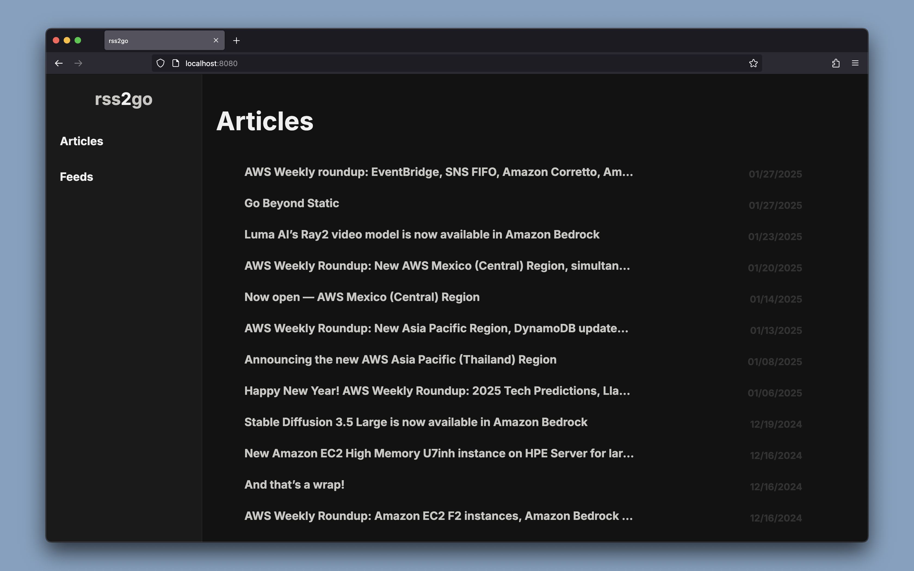

# rss2go




> rss2go is a self-hosted RSS Feed aggregator built with Go

- [Link to docker hub](https://hub.docker.com/repository/docker/nathanberry97/rss2go/general)

## Getting started

If you want to run the application locally ensure you have `sass` and `go`
installed then run the following command:

```
make run
```

Which will allow you to access the website on `localhost:8080`.

Or if you have `podman` installed you can run the following command:

```
make container
```

## Overview

Folder structure:

```txt
.
├── cmd
│   └── app
├── internal
│   ├── components
│   ├── database
│   ├── routes
│   ├── rss
│   ├── schema
│   ├── scss
│   ├── services
│   ├── utils
│   └── worker
└── web
    ├── scss
    │   ├── abstracts
    │   ├── base
    │   ├── components
    │   ├── layout
    │   ├── main.scss
    │   └── pages
    ├── static
    │   ├── images
    │   └── js
    └── templates
```

If you want to see the current make commands run `make` in your terminal, but
here is a list of the current make commands:

```txt
rss2go

Usage:
  setup                 Install pre-commit hooks
  build                 Build rss2go api
  run                   Build and run rss2go api
  test                  Test backend for rss2go app
  clean                 Clean up build artifacts
  container             Run a local containised version of the application
```

> *Note* to use the container command you will need podman install

This project uses the following technology:

- [go](https://go.dev/)
  - [gin](https://github.com/gin-gonic/gin)
  - [gofeed](https://github.com/mmcdole/gofeed)
  - [sqlite](https://pkg.go.dev/modernc.org/sqlite)
- [sass](https://sass-lang.com/)
- [htmx](https://htmx.org/)
- JavaScript

## OPML

The application supports OPML to bulk upload your feeds, to find this feature
head over to the feeds page and upload your XML file.
There is an example one in the repo called `opml.xml` or you can download
the following to save into an XML file to upload:

```txt
<?xml version="1.0" encoding="UTF-8"?>

<opml version="2.0">
  <head>
    <title>rss2go Subscriptions</title>
  </head>
  <body>
    <outline text="rss2go" title="rss2go">

      <outline text="Coding Horror" type="rss" xmlUrl="https://blog.codinghorror.com/rss" />

      <outline text="Technology in government" type="rss" xmlUrl="https://technology.blog.gov.uk/feed/" />

      <outline text="Docker" type="rss" xmlUrl="https://www.docker.com/blog/feed/" />

      <outline text="Stack Overflow Blog" type="rss" xmlUrl="https://stackoverflow.blog/feed/" />

      <outline text="Framework Blog" type="rss" xmlUrl="https://frame.work/gb/en/blog.rss" />

      <outline text="David Heinemeier Hansson" type="atom" xmlUrl="https://world.hey.com/dhh/feed.atom" />

      <outline text="Hacker News: Front Page" type="rss" xmlUrl="https://hnrss.org/frontpage" />

      <outline text="AWS News Blog" type="rss" xmlUrl="https://aws.amazon.com/blogs/aws/feed/" />

      <outline text="The Go Blog" type="atom" xmlUrl="http://blog.golang.org/feed.atom" />

      <outline text="Diomidis D. Spinellis Web Log" type="rss" xmlUrl="https://www.spinellis.gr/blog/dds-blog-rss.xml" />

      <outline text="Dan Bartlett: coach, writer, engineer &amp; founder" type="rss" xmlUrl="https://danbartlett.co.uk/index.xml" />

      <outline text="Jason Fried" type="atom" xmlUrl="https://world.hey.com/jason/feed.atom" />

      <outline text="NASA" type="rss" xmlUrl="https://www.nasa.gov/feed/" />

      <outline text="Kris Tun" type="rss" xmlUrl="https://kristun.dev/rss.xml" />

      <outline text="The GitHub Blog" type="rss" xmlUrl="https://github.blog/feed/" />

      <outline text="Roman Zipp" type="rss" xmlUrl="https://romanzipp.com/rss" />

      <outline text="The Proton Blog" type="rss" xmlUrl="https://proton.me/blog/feed" />

      <outline text="Boot.dev Blog" type="rss" xmlUrl="https://blog.boot.dev/index.xml" />

      <outline text="Oskar Wickström" type="rss" xmlUrl="https://wickstrom.tech/feed.xml" />

      <outline text="Mitchell Hashimoto" type="rss" xmlUrl="https://mitchellh.com/feed.xml" />

      <outline text="BBC News" type="rss" xmlUrl="http://feeds.bbci.co.uk/news/technology/rss.xml" />

      <outline text="Nathan Berry" type="rss" xmlUrl="https://nathanberry.co.uk/feed.xml" />

      <outline text="Raccoon’s Trash Can" type="rss" xmlUrl="https://raccoon.bearblog.dev/feed/?type=rss" />

    </outline>
  </body>
</opml>
```

## API Endpoints

```txt
# HTML Pages

GET    /                           # Articles homepage
GET    /feeds                      # View all feeds
GET    /articles/favourites        # Favourite articles
GET    /articles/later             # Read-later articles
GET    /articles/{feedId}          # Articles by feed ID

# HTMX Partials

GET    /partials/articles          # All articles (partial)
GET    /partials/articles/{id}     # All rss feed articles (partial)

GET    /partials/favourite         # Favourite list (partial)
POST   /partials/favourite/{id}    # Mark article as favourite
DELETE /partials/favourite/{id}    # Remove from favourite

GET    /partials/later             # Read-later list (partial)
POST   /partials/later/{id}        # Save article for later
DELETE /partials/later/{id}        # Remove from read-later

GET    /partials/feed              # Feed form (partial)
POST   /partials/feed              # Add new rss feed
DELETE /partials/feed/{id}         # Delete rss feed

GET    /partials/feed/opml         # OPML import form
POST   /partials/feed/opml         # Upload OPML file
```

## Local Domain + HTTPS Setup for rss2go.local (Fedora & MacOS)

> This guide shows how to serve your local Container via a custom domain
> rss2go.local with HTTPS using `Nginx` and `mkcert`, so browsers like Firefox
> and Chrome trust it.

1. First add your domain into `/etc/hosts`:
    - `127.0.0.1 rss2go.local`

2. Install Nginx:

Fedora
```bash
sudo dnf install -y nginx
sudo systemctl enable nginx
sudo systemctl start nginx
```

MacOS (Homebrew)
```bash
brew install nginx
brew services start nginx
```

3. Install mkcert:

Fedora
```bash
sudo dnf install mkcert
mkcert -install
```

MacOS
```bash
brew install mkcert
mkcert -install
```

> `mkcert -install` adds a trusted local CA to your system and Firefox
> (if supported).

4. Generate Certificates for rss2go.local:

```bash
mkcert rss2go.local
mkdir -p ~/.localCerts
mv rss2go.local.pem rss2go.local-key.pem ~/.localCerts/
```

> Move the certs to a permanent location, like in the example above

5. (Optional) Firefox Certificate Import

If Firefox does not trust the certificate:

``` bash
mkcert -CAROOT
```

- Then import rootCA.pem into Firefox:
- Open about:preferences
- Go to Privacy & Security
- Scroll to Certificates → View Certificates → Authorities
- Import rootCA.pem
- Check “Trust this CA to identify websites”

6. Nginx Configuration:

Fedora location - `/etc/nginx/conf.d/rss2go.local.conf`

MacOS location - `/usr/local/etc/nginx/servers/rss2go.local.conf`

```txt
# Redirect HTTP to HTTPS
server {
    listen 80;
    server_name rss2go.local;
    return 301 https://$host$request_uri;
}

# HTTPS server block
server {
    listen 443 ssl;
    server_name rss2go.local;

    ssl_certificate /home/example/.localCerts/rss2go.local.pem;
    ssl_certificate_key /home/example/.localCerts/rss2go.local-key.pem;

    location / {
        proxy_pass http://127.0.0.1:8000;
        proxy_set_header Host $host;
        proxy_set_header X-Real-IP $remote_addr;
        proxy_set_header X-Forwarded-For $proxy_add_x_forwarded_for;
        proxy_set_header X-Forwarded-Proto $scheme;
    }
}
```

> __Important__: Update certificate paths

7. SELinux Note (Fedora Only):

If you get “502 Bad Gateway”, allow Nginx to connect to port 8000:

```bash
sudo semanage port -a -t http_port_t -p tcp 8000
sudo systemctl reload nginx
```

> MacOS users can ignore this.

8. Validate and Reload Nginx:

Fedora
```bash
sudo nginx -t
sudo systemctl reload nginx
```

MacOS
```bash
nginx -t
brew services restart nginx
```

9. Run Your Docker Container

```bash
# Docker
docker pull nathanberry97/rss2go:latest

# Podman
podman pull docker.io/nathanberry97/rss2go:latest
```

By default, rss2go expects its database at `internal/database/rss.db` inside
the container.
To persist it on your host machine (e.g., at `~/.config/rss2go/rss.db`),
mount it as a volume:

```bash
mkdir -p ~/.config/rss2go
touch ~/.config/rss2go/rss.db

# Docker volume mount
docker run --name rss2go -dit \
  -p 8000:8080 \
  -v ~/.config/rss2go/rss.db:/app/internal/database/rss.db \
  --restart=always \
  nathanberry97/rss2go:latest

# Podman volume mount with SELinux context
podman run --name rss2go -dit \
  -p 8000:8080 \
  -v ~/.config/rss2go/rss.db:/app/internal/database/rss.db:Z \
  --restart=always \
  docker.io/nathanberry97/rss2go:latest
```

> Nginx proxies to http://127.0.0.1:8000.

10. Open Your Site

Visit: `https://rss2go.local`

> You should see your application with a valid trusted HTTPS certificate.
